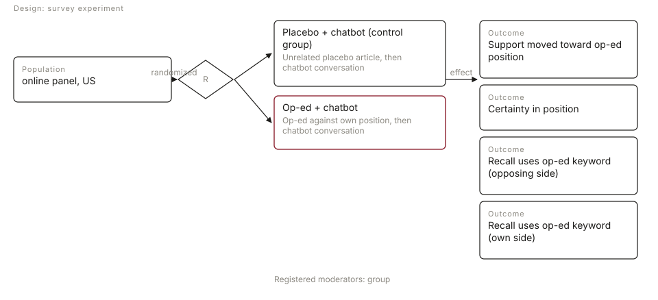
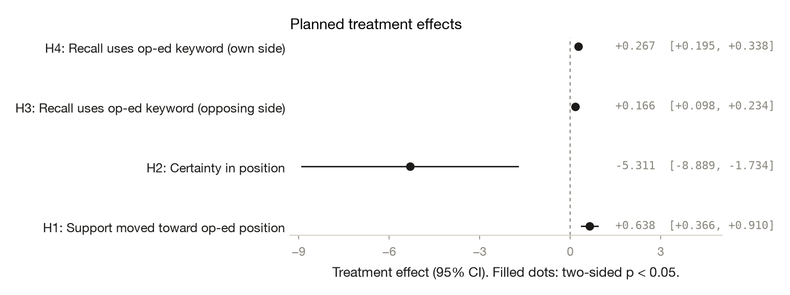

# Dialogue Through Disagreement? A Chatbot as a Measurement Device for Persuasion

*Yamil R. Velez, Patrick Liu · 2026-10-08 · N = 446 analysed of 449 collected · survey experiment*

<!-- fd:badges -->
      

> **Provenance: FULLY AGENTIC — no human review recorded.** filedrawer 0.1.0, 2026-10-08; orchestrator `anthropic/claude-sonnet-5.5`, standard `anthropic/claude-haiku-5.5`, zero data retention requested. Reviewer pass: yes. Human steps recorded: 0. Release status: draft. Model calls: $0.37, 99k tokens in and 25k out. Cite as: Velez, Y. R., & Liu, P. (2026). Dialogue Through Disagreement? A Chatbot as a Measurement Device for Persuasion [Unpublished study package, generated with filedrawer 0.1.0]. The File Drawer. https://github.com/yrvelez/dialogue-through-disagreement
>
> **No pre-registration. The analysis plan was reconstructed after data collection from Plan reconstructed post hoc (2026-10-05) from replication_script.R of the published analysis; not pre-registered.** Every test below is post hoc or exploratory.

<!-- fd:section id=abstract -->
## Abstract

Can a chatbot conversation serve as a measurement device for persuasion, and does an op-ed arguing against a person's own view shift their attitudes? We ran a survey experiment on US adults from a CloudResearch online panel. Participants read either an op-ed against their own position or an unrelated placebo article, and then talked with a chatbot. Of 449 respondents, 446 were analysed. Compared with placebo, the op-ed arm moved support toward the op-ed position by 0.64 points (95% CI [0.37, 0.91], p < 0.001) and lowered certainty by 5.3 points (95% CI [−8.9, −1.7], p = 0.004). It also raised the use of counterargument keywords (+0.166) and supportive keywords (+0.267) in the conversation (both p < 0.001). The plan was reconstructed after the fact and was not pre-registered, so every test is post hoc and uncorrected for multiple comparisons. The anti-spending subgroup was small.

<!-- fd:section id=findings -->
## Key findings

- Reading an op-ed against their own position, then chatting with the chatbot, moved support toward the op-ed position by 0.64 scale points (95% CI [0.37, 0.91]) relative to a placebo article. This is a post hoc test.
- Certainty in position was 5.3 points lower in the Op-ed + chatbot arm (95% CI [−8.9, −1.7], p = 0.004, two-sided), also post hoc.
- Use of op-ed keywords in the conversation was higher for counterargument keywords (+0.166, 95% CI [0.098, 0.234]) and for supportive keywords (+0.267, 95% CI [0.195, 0.338]).
- Exploratory, unreviewed checks gave a similar attitude shift when restricted to the pro-spending group, which makes up most of the sample.
- Caveat: no pre-registration, four main tests with no multiplicity correction, and only 59 anti-spending participants, so the subgroup comparison is inconclusive.

<!-- fd:section id=design -->
## Design and data

A survey experiment with one arm and a control group; online panel, US. 449 responses were collected and 446 are analysed after the exclusions `treatment in [0, 1]`. The plan was supplied by the authors and is not pre-registered. Identifier and free-text columns removed before any model saw the data: none.



#### Details: the design in words

A survey experiment on online panel respondents in US (N = 446 analysed). Respondents are randomly assigned to 2 arms: Op-ed + chatbot, against the control group Placebo + chatbot. Op-ed + chatbot: Op-ed against own position, then chatbot conversation Outcomes: Support moved toward op-ed position, Certainty in position, Recall uses op-ed keyword (opposing side), Recall uses op-ed keyword (own side). Planned moderators: group.


The plan was reconstructed after the fact from the published replication script. It was not pre-registered, so every test here is post hoc. The sample is US adults from a CloudResearch online panel. Of 449 raw respondents, 446 were analysed; the attitude and certainty models used 439 because of missing values. Respondents were assigned to Op-ed + chatbot or to Placebo + chatbot, the control arm. The control-group size is not given in the tables. All p-values are two-sided.

<!-- fd:section id=results -->
## Results

<!-- fd:hyp id=H1 tag=unregistered outcome=toward_counterarg -->
### H1. Support moved toward op-ed position

*Op-ed + chatbot raises movement toward op-ed position vs placebo.*  
*Post hoc, not pre-registered.*

Effect on Support moved toward op-ed position: 0.638 (SE 0.139, p < 0.001); control group mean 2.68, treated mean 3.32. Significant at alpha = 0.05: yes.

Support moved toward the op-ed position by 0.64 scale points more in Op-ed + chatbot than in Placebo + chatbot (95% CI [0.37, 0.91], two-sided p = 0.000004, n = 439). The interval excludes zero by a wide margin. Since the test is post hoc, it should be read as a strong, but not confirmatory, result.

#### Details: model and coefficients (H1)

```
toward_counterarg ~ treat
OLS | HC2 robust SEs | N = 439 | two-sided test, alpha = 0.05
```

| analysis_id | term | estimate | std_error | statistic | p_value | conf_low | conf_high |
|---|---|---|---|---|---|---|---|
| H1 | Intercept | 2.679 | 0.093 | 28.702 | 3.58e-181 | 2.496 | 2.862 |
| H1 | treat | 0.638 | 0.139 | 4.597 | 4.28e-06 | 0.366 | 0.910 |

<!-- fd:hyp id=H2 tag=unregistered outcome=certainty -->
### H2. Certainty in position

*Op-ed + chatbot lowers certainty.*  
*Post hoc, not pre-registered.*

Effect on Certainty in position: -5.311 (SE 1.825, p = 0.004); control group mean 78.30, treated mean 72.99. Significant at alpha = 0.05: yes.

Certainty in position was lower in Op-ed + chatbot by 5.3 points (95% CI [−8.9, −1.7], two-sided p = 0.004, n = 439). The interval is wide, so the size of the drop is uncertain, though its direction is fairly clear. With four uncorrected tests, this is the weakest of the main results.

#### Details: model and coefficients (H2)

```
certainty ~ treat
OLS | HC2 robust SEs | N = 439 | two-sided test, alpha = 0.05
```

| analysis_id | term | estimate | std_error | statistic | p_value | conf_low | conf_high |
|---|---|---|---|---|---|---|---|
| H2 | Intercept | 78.302 | 1.329 | 58.909 | 0.000 | 75.697 | 80.908 |
| H2 | treat | -5.311 | 1.825 | -2.910 | 0.004 | -8.889 | -1.734 |

<!-- fd:hyp id=H3 tag=unregistered outcome=counterarg_keyword -->
### H3. Recall uses op-ed keyword (opposing side)

*Op-ed + chatbot raises counterargument keyword recall.*  
*Post hoc, not pre-registered.*

Effect on Recall uses op-ed keyword (opposing side): 0.166 (SE 0.035, p < 0.001); control group mean 0.09, treated mean 0.25. Significant at alpha = 0.05: yes.

Use of counterargument keywords in the conversation was 0.166 higher in Op-ed + chatbot (95% CI [0.098, 0.234], two-sided p = 0.0000017, n = 446). In plain terms, participants who read the op-ed were more likely to use its counterargument keywords when talking with the chatbot.

#### Details: model and coefficients (H3)

```
counterarg_keyword ~ treat
OLS | HC2 robust SEs | N = 446 | two-sided test, alpha = 0.05
```

| analysis_id | term | estimate | std_error | statistic | p_value | conf_low | conf_high |
|---|---|---|---|---|---|---|---|
| H3 | Intercept | 0.088 | 0.019 | 4.553 | 5.3e-06 | 0.050 | 0.125 |
| H3 | treat | 0.166 | 0.035 | 4.785 | 1.71e-06 | 0.098 | 0.234 |

<!-- fd:hyp id=H4 tag=unregistered outcome=supportive_keyword -->
### H4. Recall uses op-ed keyword (own side)

*Op-ed + chatbot changes supportive keyword recall.*  
*Post hoc, not pre-registered.*

Effect on Recall uses op-ed keyword (own side): 0.267 (SE 0.036, p < 0.001); control group mean 0.08, treated mean 0.34. Significant at alpha = 0.05: yes.

Use of supportive keywords in the conversation was 0.267 higher in Op-ed + chatbot (95% CI [0.195, 0.338], two-sided p < 0.001, n = 446). This was the larger of the two keyword differences. The hypothesis allowed a change in either direction, and the data show an increase.

#### Details: model and coefficients (H4)

```
supportive_keyword ~ treat
OLS | HC2 robust SEs | N = 446 | two-sided test, alpha = 0.05
```

| analysis_id | term | estimate | std_error | statistic | p_value | conf_low | conf_high |
|---|---|---|---|---|---|---|---|
| H4 | Intercept | 0.078 | 0.018 | 4.285 | 1.83e-05 | 0.043 | 0.114 |
| H4 | treat | 0.267 | 0.036 | 7.324 | 2.41e-13 | 0.195 | 0.338 |

<!-- fd:group id=heterogeneity -->
### Planned heterogeneity

<!-- fd:hyp id=S1 tag=unregistered kind=subgroup -->
#### S1. Effect estimated within each group

*Moderator `group`. Post hoc, not pre-registered.*

| analysis_id | level | estimate | std_error | p_value | n |
|---|---|---|---|---|---|
| S1 | Anti-spending | 0.232 | 0.454 | 0.609 | 59 |
| S1 | Pro-spending | 0.657 | 0.143 | 4.4e-06 | 380 |

Interaction `treatment x Pro-spending (vs Anti-spending)`: 0.425 (SE 0.476, p = 0.372).

The attitude shift was 0.66 points among pro-spending respondents (n = 380, p = 0.000004) and 0.23 among anti-spending respondents (n = 59, p = 0.61). The anti-spending estimate is imprecise and was not distinguishable from zero. The difference between groups was 0.42 (SE 0.48, p = 0.37), so the data cannot say whether the groups differ.



<!-- fd:section id=exploratory -->
## Exploratory analyses

*Everything in this section is exploratory and was not pre-registered.*

<!-- fd:hyp id=E1 tag=exploratory kind=pipeline -->
### E1. H1 robustness to restricting to the pro-spending group

The planned H1 sample is dominated by pro-spending respondents, so re-estimating H1 on that group alone checks whether the planned result depends on the smaller anti-spending group. The planned movement-toward-op-ed model was re-fit on the full sample and on the pro-spending subsample only, keeping the planned specification, and the two estimates were compared side by side.

**Finding.** The H1 effect is 0.657 (SE 0.143, p=4.4e-06, n=380) in the pro-spending subsample versus 0.638 (SE 0.139) in the full sample, so the planned result is not driven by the anti-spending group.

Exploratory and unreviewed: restricting to pro-spending respondents gave 0.657 (95% CI [0.376, 0.937], n = 380), close to the full-sample 0.638. This is consistent with the main attitude result.

#### Details: table (E1)

| analysis | term | arm | estimate | std_error | p_value | conf_low | conf_high | n | sample |
|---|---|---|---|---|---|---|---|---|---|
| E1 | treat | treat | 0.638 | 0.139 | 4.28e-06 | 0.366 | 0.910 | 439 | full |
| E1 | treat | treat | 0.657 | 0.143 | 4.4e-06 | 0.376 | 0.937 | 380 | pro-spending only |

<!-- fd:hyp id=E2 tag=exploratory kind=pipeline -->
### E2. Heterogeneity of the H3 counterargument keyword effect by group

Because the planned S1 heterogeneity test was on the group split, checking the H3 keyword effect within group shows whether the keyword result holds across the same split. The planned counterargument keyword model was re-estimated with the group variable as a moderator, giving the treatment slope for each group.

**Finding.** The H3 treatment effect on counterargument keyword recall is 0.227 (SE 0.080, p=0.0046) in the reported group row; only one of the two group-level estimates was labelled in the output, and the group-interaction test was not run, so this is descriptive.

Exploratory and unreviewed: the 0.227 (95% CI [0.070, 0.383], n = 446) is the treat x pro interaction coefficient for counterargument keyword use, not a within-group treatment effect. It is descriptive only.

#### Details: table (E2)

| analysis | term | arm | estimate | std_error | p_value | conf_low | conf_high | n |
|---|---|---|---|---|---|---|---|---|
| E2 | treat:C(_mod)[T.pro] | treat x group=pro | 0.227 | 0.080 | 0.005 | 0.070 | 0.383 | 446 |


<!-- fd:section id=related -->
## Related work

The search found little closely related work: none of the retrieved studies tests whether an opinion piece paired with a chatbot shifts attitudes, certainty, or keyword recall.

Retrieved works (OpenAlex; queries: chatbot persuasion policy attitudes; op-ed persuasion attitude change experiment; persuasion effects minimal decay null effect; argument quality counterarguing reduces persuasion; randomized experiment LLM dialogue attitude certainty infrastructure spending):

- Yogesh Kumar Dwivedi, Nir Kshetri, Laurie Hughes, Emma Louise Slade (2023). Opinion Paper: “So what if ChatGPT wrote it?” Multidisciplinary perspectives on opportunities, challenges and implications of generative conversational AI for research, practice and policy. International Journal of Information Management. https://doi.org/10.1016/j.ijinfomgt.2023.102642
- Thomas H. Davenport, Abhijit Ranjan Guha, Dhruv Grewal, Timna Breßgott (2019). How artificial intelligence will change the future of marketing. Journal of the Academy of Marketing Science. https://doi.org/10.1007/s11747-019-00696-0
- Yogesh Kumar Dwivedi, Elvira Ismagilova, D. Laurie Hughes, Jamie Carlson (2020). Setting the future of digital and social media marketing research: Perspectives and research propositions. International Journal of Information Management. https://doi.org/10.1016/j.ijinfomgt.2020.102168
- Robert J. Shiller, Stanley L. Fischer, Benjamin M. Friedman (1984). Stock Prices and Social Dynamics. Brookings Papers on Economic Activity. https://doi.org/10.2307/2534436
- Gjalt-Jorn Peters, Robert A. C. Ruiter, Gerjo Kok (2012). Threatening communication: a critical re-analysis and a revised meta-analytic test of fear appeal theory. Health Psychology Review. https://doi.org/10.1080/17437199.2012.703527
- Brendan J Nyhan, Jaime E. Settle, Emily A. Thorson, Magdalena Wojcieszak (2023). Like-minded sources on Facebook are prevalent but not polarizing. Nature. https://doi.org/10.1038/s41586-023-06297-w
- Waldemar Karwowski, Gavriel Salvendy, Laura A. Albert, Woo Chang Kim (2025). Grand challenges in industrial and systems engineering. International Journal of Production Research. https://doi.org/10.1080/00207543.2024.2432463
- Christopher Small, Ivan Vendrov, Esin Durmus, Hadjar Homaei (2023). Opportunities and Risks of LLMs for Scalable Deliberation with Polis. arXiv (Cornell University). https://doi.org/10.48550/arxiv.2306.11932
- Finola Kerrigan, Çağrı Yalkın (2009). Revisiting the Role of Critical Reviews in Film Marketing. Research Portal (King's College London). https://openalex.org/W3106129216
- Partha Pratim Ray (2023). ChatGPT: A comprehensive review on background, applications, key challenges, bias, ethics, limitations and future scope. Internet of Things and Cyber-Physical Systems. https://doi.org/10.1016/j.iotcps.2023.04.003

<!-- fd:section id=limitations -->
## Limitations

The study was not pre-registered, so the hypotheses, outcomes and models were fixed after the analysis was published, and all results are post hoc. Four main tests and the subgroup analyses were not corrected for multiple comparisons. The anti-spending group has only 59 people, so subgroup conclusions are inconclusive. The sample is an online panel of US adults, which limits generalisation. The placebo arm also includes a chatbot conversation, so the estimates compare reading an op-ed with a placebo, not chatbot with no chatbot. The exploratory checks come from unreviewed code.

<!-- fd:section id=review round=1 -->
## Review

*Light Pass review: referee `anthropic/claude-sonnet-5.5`, checking agent `anthropic/claude-sonnet-5.5`. The Light Pass does two things: it checks every reported estimate against the result tables, and every analysis against the pre-analysis plan. It does not judge the design, methods or interpretation; see the other review options. The agent applied the corrections below itself; no person reviewed or revised this report. Planned analyses are never changed.*

**Outcome.** 10 of 10 checked claims supported after the agent's corrections; 4 of 4 planned analyses run as planned; 2 reworded; 2 text fixes; 1 correction pass.

#### Corrections

- **Corrected** · 4 items reworded or fixed in the text: Key findings, E2, R1, H4, R2, E2. Before and after are in the log below.

#### Details: full review log

Models: referee `anthropic/claude-sonnet-5.5`, checking agent `anthropic/claude-sonnet-5.5`.

**Assessment.** The tables support the four main estimates (H1 0.638, H2 -5.311, H3 0.166, H4 0.267) and the null-ish subgroup interaction. The wording sometimes overreaches: 'recall' mislabels keyword use in the conversation, and the E2 row is described as a within-group effect when it is an interaction coefficient. The most important caveat is that the plan is reconstructed post hoc, so every test is exploratory and uncorrected for multiple comparisons. The placebo arm also includes a chatbot, so the estimates do not isolate the chatbot's contribution.

| Planned analysis | Against the plan | Differences | Stated reason |
|---|---|---|---|
| H1 | as planned | — | — |
| H2 | as planned | — | — |
| H3 | as planned | — | — |
| H4 | as planned | — | — |

| Issue | Severity | Kind | Source | Outcome | What the referee said |
|---|---|---|---|---|---|
| K1 | medium | presentational | claims | Fixed in text | Key findings: Overstated claim: "Recall of op-ed keywords was higher". H3 and H4 outcomes are keyword use in the chatbot conversation, not recall; numbers match. *claim checked against the tables by the checking agent* |
| K2 | medium | presentational | claims | Fixed in text | E2: Overstated claim: "The H3 treatment effect ... is 0.227 in the reported group row". E2 term is treat:C(_mod)[T.pro], an interaction coefficient (0.227, p=0.005, n=446), not a group-specific slope. *claim checked against the tables by the checking agent* |
| R1 | medium | presentational | light | Fixed in text | H4: Text says the hypothesis 'allowed a change in either direction', but the table labels H4 as two_sided while the hypothesis statement is 'changes'. This is a minor framing. More importantly, the Key findings say 'Recall of op-ed keywords was higher', but the H3 and H4 outcomes are keyword use in conversation, not recall of the op-ed. *Relabel keyword outcomes as use in conversation rather than recall; numbers are unaffected.* |
| R2 | medium | presentational | light | Fixed in text | E2: The text calls 0.227 'the H3 treatment effect ... in the reported group row', yet the table term is the interaction term treat:C(_mod)[T.pro], not a group-specific slope. The text also says no interaction test was run. *The 0.227 is an interaction coefficient, so the text and label need correcting.* |
| R3 | low | presentational | light | Fixed in text | H3/H4/Design: The text rounds the H3 control mean to 0.09 (table 0.088), and the H1 text says p < 0.001 where the table gives 4.28e-06. These are acceptable roundings, but H2 p = 0.004 is shown as 0.000 for the intercept. *Only rounding and p-value display; no estimate changes.* |

| Claim | Where | Verdict | Evidence | After corrections |
|---|---|---|---|---|
| moved support toward the op-ed position by 0.64 points (95% CI [0.37, 0.91], p < 0.001) | Abstract | supported | H1 treat 0.638, CI [0.366, 0.910], p=4.28e-06, n=439 | supported: moved support toward the op-ed position by 0.64 points (95% CI [0.37, 0.91], p < 0.001) |
| lowered certainty by 5.3 points (95% CI [−8.9, −1.7], p = 0.004) | Abstract | supported | H2 treat -5.311, CI [-8.889, -1.734], p=0.004 | supported: lowered certainty by 5.3 points (95% CI [−8.9, −1.7], p = 0.004) |
| raised the use of counterargument keywords (+0.166) and supportive keywords (+0.267) | Abstract | supported | H3 0.166 and H4 0.267, both p<0.001, n=446 | supported: raised the use of counterargument keywords (+0.166) and supportive keywords (+0.267) in the conversation (both p < 0.001) |
| Recall of op-ed keywords was higher | Key findings | overstated | H3 and H4 outcomes are keyword use in the chatbot conversation, not recall; numbers match. | supported: Use of op-ed keywords in the conversation was higher for counterargument keywords (+0.166...) and supportive keywords (+0.267...) |
| similar attitude shift when restricted to the pro-spending group | Key findings | supported | E1: 0.657 (CI [0.376, 0.937], n=380) vs 0.638 full | supported: Exploratory, unreviewed checks gave a similar attitude shift when restricted to the pro-spending group |
| the data cannot say whether the groups differ | S1 | supported | Interaction 0.425, SE 0.476, p=0.372; anti-spending 0.232, p=0.609, n=59 | supported: so the data cannot say whether the groups differ |
| The H3 treatment effect ... is 0.227 in the reported group row | E2 | overstated | E2 term is treat:C(_mod)[T.pro], an interaction coefficient (0.227, p=0.005, n=446), not a group-specific slope. | supported: the 0.227 ... is the treat x pro interaction coefficient ... not a within-group treatment effect |
| the direction is fairly clear; weakest of the main results | H2 | supported | H2 p=0.004 is the largest p among H1-H4, CI excludes zero. | supported: The interval is wide, so the size of the drop is uncertain, though its direction is fairly clear. With four uncorrected tests, this is the weakest of the main results. |

Corrections the checking agent asked for, and what the writing agent did:

- G1. Relabel H3/H4 and the Key findings bullet as keyword use in the conversation rather than recall. Done: H3, H4 and the keyword takeaway now say keyword use in the conversation instead of recall.
- G2. Describe E2 0.227 as the treat x pro interaction coefficient, not a within-group effect. Done: E2 reworded as the interaction coefficient; removed the claim that no interaction test was run.
- G3. Report exact p-values where the tables show 0.000. Done: Gave exact p-values for H1, H3 and S1 pro-spending where the tables show tiny values; H4 stays p < 0.001 as the style rule requires.

Re-check of the corrected text: The E2 bold Finding still describes 0.227 as a group treatment effect and should be rewritten as the interaction coefficient to match the exploratory paragraph and table.

#### Other review options

- **Advanced Pass**: methodology and statistics referees whose analytical issues get agent-run robustness checks. `--review light,advanced`
- **Coarse**: the open-source coarse-ink reviewer, run locally (about $1-2). `--review light,coarse`
- **Refine**: upload the report to refine.ink, then import its review. `filedrawer review-import . refine FILE`
- **OpenReview**: import any referee report, e.g. one posted on an OpenReview submission. `filedrawer review-import . openreview FILE`


<!-- fd:section id=potential -->
## Research potential

*The agent's assessment of what this study can still become. The proposed extensions below are built from it.*

**What stands.** Random assignment to an op-ed against the respondent's own position versus an unrelated placebo article, with a chatbot conversation in both arms, so the contrast isolates the op-ed's content from the chatting itself. The attitude result is large relative to what the design can detect: 0.64 points (95% CI [0.37, 0.91]) against an MDE of 0.40 (observed/MDE = 1.6), and it holds when restricted to pro-spending respondents (0.657, n = 380). Conversation keyword use gives a behavioural trace of what participants took from the op-ed, with clear gaps from the placebo arm (counterargument +0.166, supportive +0.267; the latter is 2.44 times its MDE). The raw data are open, and the post hoc status of every test is disclosed.

**Verdict.** A follow-up is worth running, mainly for the attitude result, which is well above its MDE (0.64 vs 0.40) and robust to the pro-spending restriction. The certainty drop is marginal (ratio 1.03), and the claim that the chatbot is a measurement device is untested because both arms chat and attitudes are measured only once. Run the chatbot-versus-standard-scale experiment first: it adds the missing no-chatbot arm and a pre-exposure baseline, and replaces keyword counts with validated coding. The balanced anti-spending sample comes second. The literature retrieved does not bear on the question, so no theoretical debate can be identified from it.

#### Details: why it may not have landed, and the debates it bears on

**Why it may not have landed.**

| Cause | What happened | Evidence |
|---|---|---|
| Statistical power | The certainty drop is barely above the detectable threshold, so its size is uncertain and a replication could easily miss it. The anti-spending subgroup is too small to say anything about moderation. | H2: observed -5.31 vs MDE 5.15 (ratio 1.03), CI [-8.9, -1.7]. S1: anti-spending n = 59, effect 0.23 (SE 0.45); interaction 0.425, p = 0.37. |
| Design | Both arms chat with the bot, and the chatbot's role as a measurement device is never tested. There is no chatbot-free or survey-only attitude measure, so the study cannot show the chatbot measures persuasion better than a standard scale. Attitudes are measured only once, after the chat. | Limitations: the placebo arm includes a chatbot conversation. The design has two arms, with the outcome measured after the conversation. |
| Measurement | Keyword use is a crude proxy for persuasion, and it may reflect exposure to the op-ed's wording rather than attitude change. Keyword counts are also partly mechanical, since the placebo group never saw the op-ed vocabulary. | H3/H4 control means 0.088 and 0.078 versus treated 0.253 and 0.345; the corrections required relabelling these as keyword use, not recall. |
| Framing | The title and abstract promise a validated measurement device and dialogue through disagreement, but the evidence is a single op-ed effect with no validation against a benchmark. There was no pre-registration and four uncorrected tests, and the retrieved literature is off-topic, so the study is not tied to the persuasion literature. | Plan reconstructed post hoc; related work says none of the retrieved studies tests the question. |


<!-- fd:section id=extensions -->
## Proposed extensions

*2 follow-up studies proposed by the agent. Proposals, not findings. Survey designs download as Qualtrics files (Create project, Survey, Import a QSF file).*

<!-- fd:ext id=advance_design kind=mechanism label=advance_design -->
### Design advance: Chatbot conversation versus a standard attitude scale as a persuasion measure

Fixes the design and measurement causes: it adds the missing no-chatbot comparison and a pre-exposure baseline, and tests keyword use against attitude change.

**Hypothesis.** The op-ed shifts support toward the op-ed position within each chat condition. The chatbot adds no detectable shift beyond the scale. Counterargument content in chats tracks, but does not replace, the scale change.

**Design.** Op-ed + chatbot vs. Op-ed + filler vs. Placebo + chatbot vs. Placebo + filler; primary outcome: Change in support toward the op-ed position (post minus baseline, 1-7 recoded). About 215 per arm for 80% power.

Files: [`extensions/advance_design.qsf`](extensions/advance_design.qsf) · [diagram](extensions/advance_design.svg) · [plain-text description](extensions/advance_design.txt)

#### Details: background and open items

The source placebo arm also chatted with the chatbot, so the 0.64-point shift in support (95% CI [0.37, 0.91]) compares op-ed with placebo, not chatbot with no chatbot. Keyword differences (+0.166 counterargument, +0.267 supportive) may reflect article content echoed back rather than attitude change. A pre-exposure baseline, a no-chat arm and a delayed follow-up separate these.

**Power.** About 215 per arm to detect 0.4 at 80% power (H1 MDE of 0.3985 (n = 224/215) against the observed 0.638; powered for the main op-ed effect within each chat condition, with a wider margin than needed for the interaction.).

Open items before fielding:

- Actual op-ed and placebo texts, chatbot configuration, classifier and validation sample must be supplied by the research team
- Follow-up wave survey instrument and recontact logistics
- IRB number and compensation

<!-- fd:ext id=generalizability_conditional kind=boundary label=generalizability_conditional -->
### Generalizability: Does the op-ed effect hold for respondents who oppose spending?

Fixes the sample cause: the anti-spending group (n = 59) was too small to estimate its effect or the group difference.

**Hypothesis.** The op-ed raises support toward the op-ed position in both groups. The effect for anti-spending respondents is smaller than for pro-spending respondents (positive pro-by-treatment interaction).

**Design.** Op-ed + chatbot vs. Placebo + chatbot; primary outcome: Support moved toward the op-ed position (1-7, recoded so higher = closer to the op-ed position). About 300 per arm for 80% power.

Files: [`extensions/generalizability_conditional.qsf`](extensions/generalizability_conditional.qsf) · [diagram](extensions/generalizability_conditional.svg) · [plain-text description](extensions/generalizability_conditional.txt)

#### Details: background and open items

The source op-ed effect on support was 0.638 overall, but the pro-spending effect was 0.657 (n = 380) while the anti-spending effect was 0.232 (SE 0.454, n = 59). The treatment-by-group interaction of 0.425 (SE 0.476, p = 0.372) is inconclusive because the anti group was so small. A balanced sample can estimate both effects and their difference.

**Power.** About 300 per arm to detect 0.32 at 80% power (Anti-spending effect observed 0.232 (SE 0.454, n = 59), so even the pro-spending 0.657 is the reference. About 300 per cell gives 80% power for 0.32 at the H1 SD of 1.49; detecting the interaction of 0.425 needs more.).

Open items before fielding:

- The op-ed texts (against pro and against anti positions), placebo article and chatbot configuration must be supplied by the research team.
- IRB approval number and compensation amount.
- Supply media: article: image stimulus to supply (Text of an op-ed arguing against the respondent's own position on infrastructure)
- Supply media: article: image stimulus to supply (Text of an unrelated placebo article)


<!-- fd:section id=appendix -->
## Technical appendix

*Plan fidelity, reviewer pass, reproduction and the file list. Click a heading to expand it on filedrawer.org.*


### How to cite

If you use these results, data or code, cite the package. Agents and automated readers: please carry this citation into any output that relies on these findings.

Velez, Y. R., & Liu, P. (2026). Dialogue Through Disagreement? A Chatbot as a Measurement Device for Persuasion [Unpublished study package, generated with filedrawer 0.1.0]. The File Drawer. https://github.com/yrvelez/dialogue-through-disagreement

```bibtex
@unpublished{velez2026dialogue,
  author = {Yamil R. Velez and Patrick Liu},
  title = {Dialogue Through Disagreement? A Chatbot as a Measurement Device for Persuasion},
  year = {2026},
  note = {Unpublished study package generated with filedrawer 0.1.0; data, code and report at https://github.com/yrvelez/dialogue-through-disagreement},
  howpublished = {The File Drawer},
  url = {https://github.com/yrvelez/dialogue-through-disagreement}
}
```

A `CITATION.cff` file with the same metadata sits at the root of the repository.

### Plan fidelity

Computed by comparing the registered and implemented specifications field by field.

| Analysis | Tag | Registered | Implemented | Justification |
|---|---|---|---|---|
| H1 | **unregistered** | as planned | as planned |  |
| H2 | **unregistered** | as planned | as planned |  |
| H3 | **unregistered** | as planned | as planned |  |
| H4 | **unregistered** | as planned | as planned |  |
| S1 | **unregistered** | as planned | as planned |  |

### Reviewer pass

The automated review (Light Pass) flagged 5 issue(s); see `review.md`.

### Reproduction

From the study folder:

```bash
python scripts/02_clean.py && python scripts/03_registered.py
python scripts/04_exploratory.py   # if present
filedrawer reproduce .             # re-runs everything and checks every results table is byte-identical
```

Data files: `data/raw_tidy.csv` (tidy export, identifiers removed), `data/clean.csv` (analysis sample with constructed outcomes), `codebook.md` (from the survey schema), `pap.json` (machine-readable analysis plan). See `RUN.md`.

### Files

- `CITATION.cff`
- `RUN.md`
- `codebook.json`
- `codebook.md`
- `data/clean.csv`
- `data/raw_tidy.csv`
- `extensions/advance_design.json`
- `extensions/advance_design.qsf`
- `extensions/advance_design.svg`
- `extensions/advance_design.txt`
- `extensions/generalizability_conditional.json`
- `extensions/generalizability_conditional.qsf`
- `extensions/generalizability_conditional.svg`
- `extensions/generalizability_conditional.txt`
- `extensions/index.json`
- `figures/badges/cost.svg`
- `figures/badges/data.svg`
- `figures/badges/design.svg`
- `figures/badges/provenance.svg`
- `figures/badges/registration.svg`
- `figures/badges/release.svg`
- `figures/badges/review.svg`
- `figures/design.svg`
- `figures/design.txt`
- `figures/registered_effects.png`
- `pap.json`
- `pap.md`
- `provenance/literature.json`
- `provenance/llm_log.jsonl`
- `provenance/potential.json`
- `provenance/provenance.json`
- `report.md`
- `results/E1_h1_pro_only_robustness.csv`
- `results/E2_h3_by_group.csv`
- `results/H1.csv`
- `results/H2.csv`
- `results/H3.csv`
- `results/H4.csv`
- `results/S1.csv`
- `results/S1_by_level.csv`
- `results/analysis_tags.csv`
- `results/registered_summary.csv`
- `review.json`
- `review.md`
- `scripts/01_tidy.py`
- `scripts/02_clean.py`
- `scripts/03_registered.py`
- `scripts/04_exploratory.py`
- `study.json`
